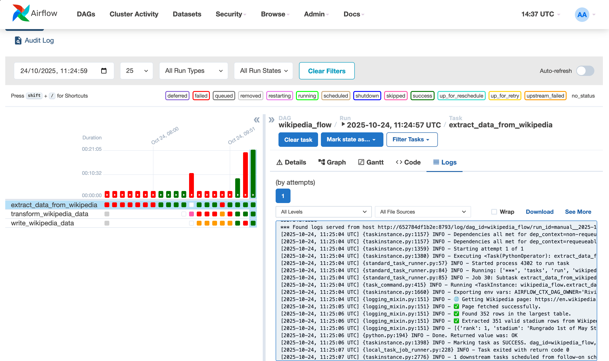
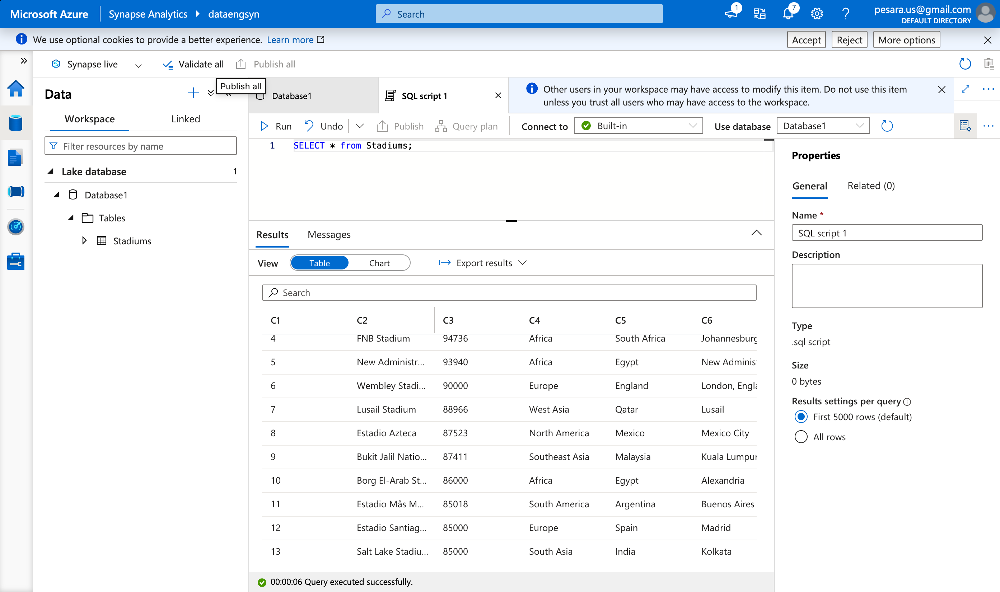
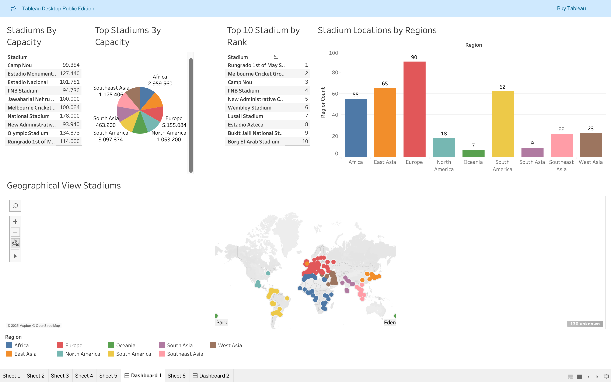

# Football Data Engineering

This Python-based project crawls data from Wikipedia using Apache Airflow, cleans it and pushes it Azure Data Lake for processing.

## Table of Contents

1. [System Architecture](#system-architecture)
2. [Requirements](#requirements)
3. [Getting Started](#getting-started)
4. [Running the Code With Docker](#running-the-code-with-docker)
5. [How It Works](#how-it-works)


## System Architecture


## Requirements
- Python 3.9 (minimum)
- Docker
- PostgreSQL
- Apache Airflow 2.6 (minimum)

## Getting Started

1. Clone the repository.
   ```bash
   git clone https://github.com/airscholar/FootballDataEngineering.git
   ```

2. Install Python dependencies.
   ```bash
   pip install -r requirements.txt
   ```
   
## Running the Code With Docker

#### Step 1: Create an Azure Account  
If you don’t already have one, sign up at [https://azure.microsoft.com](https://azure.microsoft.com).

#### Step 2: Create a Resource Group  
In the Azure Portal, go to **Resource Groups → Create Resource Group**,  
e.g., `FootballDataEngineeringRG`.

#### Step 3: Create a Storage Account  
1. Navigate to **Storage Accounts → Create**  
2. Choose your Resource Group and give it a name (e.g., `dataengfootball`)  
3. Enable **Hierarchical Namespace** (important for ADLS Gen2)  
4. After it’s created, go to **Containers** and create a new one named `footballdata`.  
   Inside, create a folder called `data` to store your CSV files.

#### Step 4: Get Storage Account Key and URL  
Go to **Access Keys** under your Storage Account and copy **Key1**.  
You’ll also need the ADLS Gen2 URL, which looks like:In your `wikipedia_pipeline.py`, you’ll find this code section:

```python
df.to_csv(
    'abfs://footballdata@dataengfootball.dfs.core.windows.net/data/' + file_name,
    storage_options={
        'account_key': 'your_key_here'
    },
    index=False
)``` 
   ```
5. Create Azure Data Factory and create pipeline to get data to ready folder from extracted folder
6. Create Azure Synapse for analyse 

7. Start your services on Docker with
   ```bash
   docker compose up -d
8. Trigger the DAG on the Airflow UI.

## How It Works
1. Fetches data from Wikipedia.
2. Cleans the data.
3. Transforms the data.
4. Pushes the data to Azure Data Lake.

## Air Flow UI


##  Azure Synapse


## Visualizing our analytics in Tableau

